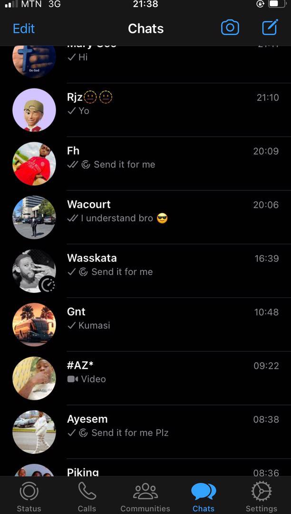
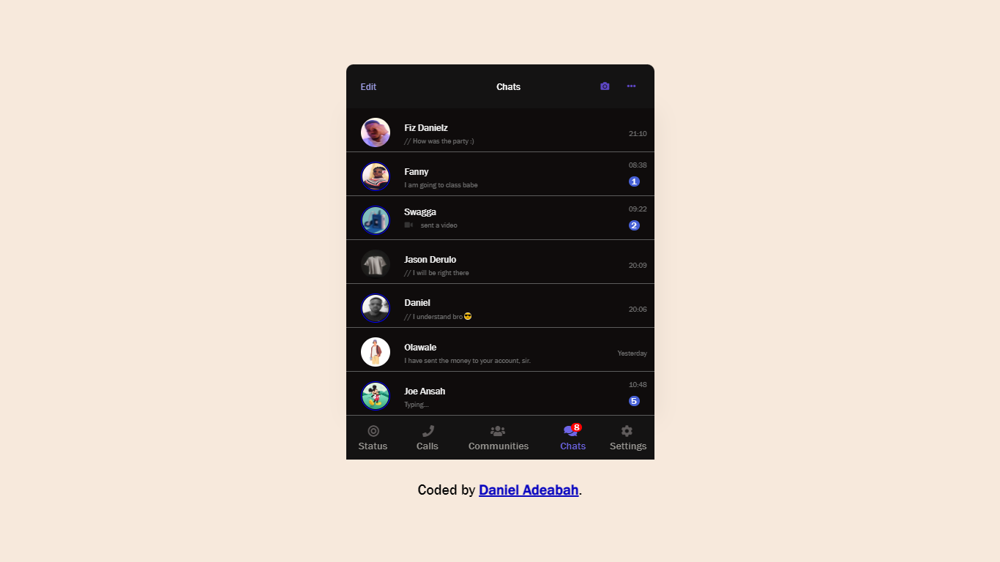

# whatsApp-app-mobile

I created this whatsApp-mobile-clone ui as part of a challenge with friends, asking them to send me a screenshot from any app on their phone to improving my front-end skills.

### screenshot from 0riginal app

### screenshot of what I built
